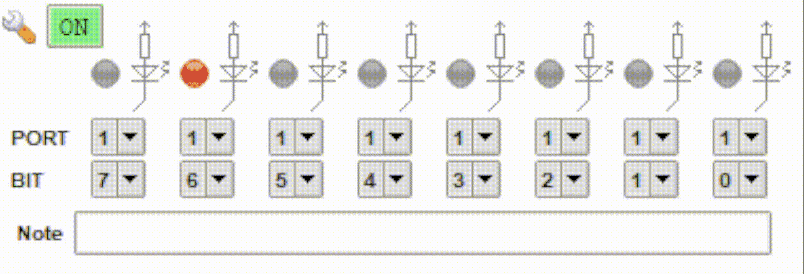

# 8051 Microcontroller Assembly Examples

This repository contains a collection of simple assembly programming examples for the 8051 microcontroller series, specifically the AT89S52 model by Atmel.

  

  <small>Knight Rider Effect</small>

## Getting Started

To get started, follow the instructions below:

### Prerequisites

1. Install the [mcu8051ide](https://sourceforge.net/projects/mcu8051ide/) development environment.

### Setting Up a New Project

1. Open `mcu8051ide`.
2. Navigate to `Project -> New`.
3. Enter a project name and select a location for the project.
4. Select the chip model `AT89S52`.
5. Save the newly created project file.

### Loading Examples

1. Copy the code from the desired example file.
2. Load the corresponding **Virtual Hardware** configuration from the `./virtual_hw_config` directory to simulate the hardware.
3. **Save** the code and start the simulator.

## Examples

Below is a list of available examples with links to their respective assembly files:

1. [Dead Man's Switch](examples/2_dead_mans_switch.asm)
2. [Print Odd Numbers on Click](examples/1_print_odd_num_on_click.asm)
3. [Click Counter](examples/3_click_counter.asm)
4. [Semaphores](examples/4_semaphores.asm)
5. [Stopwatch](examples/5_stopwatch.asm)
6. [Progress Bar](examples/6_progress_bar.asm)
7. [Running Light](examples/7_running_light.asm)
8. [Reaction Timer](examples/8_reaction_timer.asm)
9. [Staircase Automatic Lights](examples/9_staircase_automatic_lights.asm)
10. [Compare the Ones](examples/10_compare_the_ones.asm)
11. [Knight Rider Effect](examples/11_knight_rider_effect.asm)
12. [More Timers](examples/12_more_timers.asm)

## Notes

- These examples were created in March 2019 as part of the high school subject *Computer Hardware Equipment* and may not follow best practices. However, they remain useful for anyone looking for simple examples to learn and practice assembly programming.
